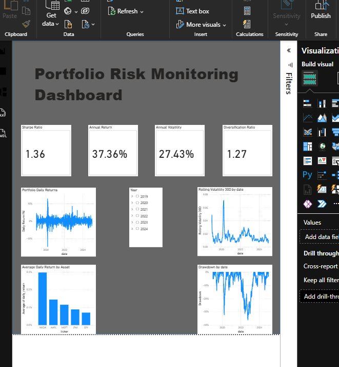
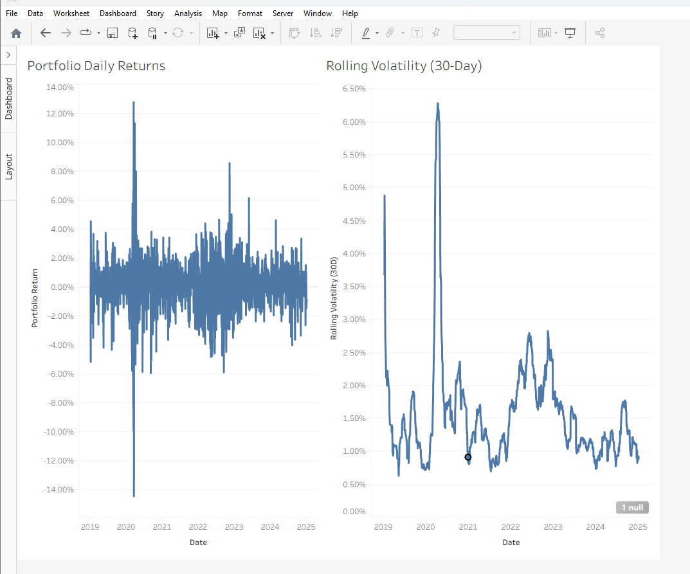

# Equity Risk Forecasting & Portfolio Risk Dashboard

## Overview
This project analyzes equity portfolio performance and risk using Python, SQL, Power BI, and Tableau. It calculates returns, volatility, and diversification metrics, then visualizes them through interactive dashboards to help understand portfolio behavior and downside risk.

The goal of the project is to demonstrate how financial data can be transformed into actionable insights for portfolio monitoring and risk management.

---

## Key Features

### Portfolio Performance Analysis
- Daily portfolio return calculation
- Cumulative return tracking
- Asset-level return comparison

### Risk Analytics
- Rolling volatility analysis
- Portfolio drawdown measurement
- Diversification ratio
- Risk contribution insights

### Quantitative Modeling
- Monte Carlo simulation for portfolio risk
- Value at Risk (VaR) estimation
- Expected Shortfall analysis
- Efficient frontier portfolio optimization

### Business Intelligence Dashboards
- Interactive portfolio risk monitoring dashboard built in **Power BI**
- Replicated risk visualization dashboard built in **Tableau**

---

## Tools & Technologies

- **Python** (Pandas, NumPy, Matplotlib)
- **SQL** for data preparation
- **Jupyter Notebook** for analysis and modeling
- **Power BI** for interactive dashboards
- **Tableau** for cross-platform visualization

---

## Project Structure

```
equity-risk-forecasting
│
├── data_clean/            # Cleaned datasets
├── sql_scripts/           # SQL data preparation
├── Day4_MonteCarlo/       # Monte Carlo risk simulation
├── Day5_Backtesting/      # VaR backtesting analysis
├── Day7_Stress_Testing/   # Stress scenario analysis
├── Day10-14_Optimization/ # Portfolio optimization
├── powerbi/               # Power BI dashboards
├── tableau/               # Tableau dashboards
├── excel_model/           # Supporting Excel analysis
└── documentation/         # Project documentation
```

---

## Example Risk Dashboard

The project produces a portfolio risk monitoring dashboard including:

- Portfolio Daily Returns
- Rolling Volatility (30-day)
- Portfolio Drawdown
- Annual Return & Volatility
- Sharpe Ratio
- Diversification Metrics

These visualizations help identify periods of elevated risk, downside exposure, and asset performance dynamics.

## Power BI Dashboard



## Tableau Dashboard




## How to Run the Project

1. Clone the repository
2. Install required Python libraries
3. Open the Jupyter notebooks
4. Run the analysis to reproduce the portfolio metrics and visualizations

---

## Project Purpose

This project demonstrates practical skills in:

- financial data analysis
- quantitative risk modeling
- data pipelines
- dashboard-based financial reporting
